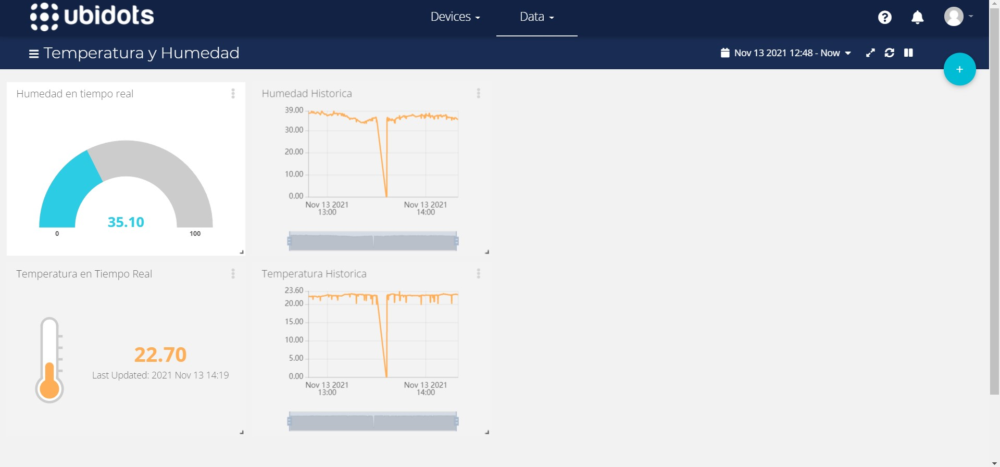

# Temperatura y Humedad IoT con ESP32

> Trabajo en progreso

Este proyecto puede ser usado para recolectar datos de temperatura y humedad usando el sensor DHT22, conectato a un módulo ESP32 con conexión a un Punto de Acceso WiFi. El ESP32 envía los valores a la [API de Datos de Ubidots](https://docs.ubidots.com/v1.6/reference/welcome) a través de HTTP usando una petición POST.



## Este proyecto fue creado usando el ejemplo 'sample-project' de ESP-IDF
Este ejemplo es el más simple que puede ser compilado. Es usado por el comando `idf.py create-project`, el cual copia la plantilla del proyecto al directorio especificado por el usuario. Para más información sobre la creación de proyectos y el uso de ejemplos en ESP-IDF, lea [cómo empezar un nuevo proyecto](https://docs.espressif.com/projects/esp-idf/en/latest/api-guides/build-system.html#start-a-new-project).

## Estructura de Directorios

La plantilla **sample_project** inicialmente contiene un archivo fuente de C, [main.c](main/main.c). El archivo está ubicado en la carpeta [main](main) y contiene el punto de entrada de la aplicación (app_main()).

Los proyectos en ESP-IDF son compilados usando CMake. La configuración de compilación del proyecto se encuentra en archivos `CMakeLists.txt` que proporcionan un conjunto de directivas e instrucciones describiendo los archivos fuente del proyecto y sus objetivos (ejecutable, librería, o ambos). 

La estructura de directorios del proyecto incluye:

```
├── CMakeLists.txt
├── components
│   ├── dht22
│   ├── http_client
│   └── wifi_setup
├── main
│   ├── CMakeLists.txt
│   └── main.c
└── README.md                  Este es el archivo que estás leyendo ahora mismo.
```
Además, el proyecto de ejemplo contiene archivos `Makefile` y `component.mk`, usados para sistemas de compilación de legado basados en Make. 
No son usadas o necesitadas al compilar usando CMake e idf.py.

## Otros Recursos

* [Referencia de la API de Datos HTTP de Ubidots](https://docs.ubidots.com/v1.6/reference/http) 
* [Comienza con ESP-IDF v4.3.1](https://docs.espressif.com/projects/esp-idf/en/v4.3.1/esp32/get-started/index.html)
* [Cliente HTTP con ESP - Referencia](https://docs.espressif.com/projects/esp-idf/en/v4.3.1/esp32/api-reference/protocols/esp_http_client.html)
* [ESP-IDF en GitHub](https://github.com/espressif/esp-idf)