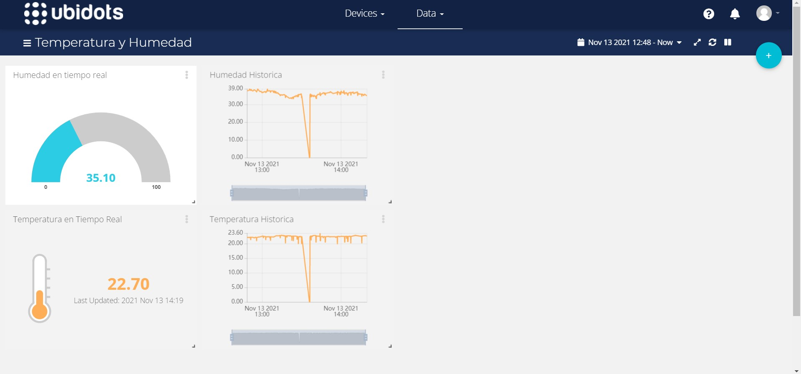

# IoT Temperature and Humidity with ESP32

> Work in Progress

This project can be used to gather temperature and humidity data using the DHT22 sensor, connected to an ESP32 module connected to a WiFi Access Point. The ESP32 then sends the values to the [Ubidots Data API](https://docs.ubidots.com/v1.6/reference/welcome) over HTTP using a POST request.



## This project was created using the 'sample-project' example from ESP-IDF
This is the simplest buildable example. The example is used by the `idf.py create-project` command, which copies the project template to path specified by the user with the desired folder name. For more information about project creation and examples in ESP-IDF, read [how to start a new project](https://docs.espressif.com/projects/esp-idf/en/latest/api-guides/build-system.html#start-a-new-project).

## Folder Structure

The **sample_project** template initially contains one C source file [main.c](main/main.c). The file is located in the [main](main) folder and contains the program entry point (app_main()).

ESP-IDF projects are built using CMake. The project build configuration is contained in `CMakeLists.txt`
files that provide set of directives and instructions describing the project's source files and targets
(executable, library, or both). 

The project folder structure includes:

```
├── CMakeLists.txt
├── components
│   ├── dht22
│   ├── http_client
│   └── wifi_setup
├── main
│   ├── CMakeLists.txt
│   └── main.c
└── README.md                  This is the file you are currently reading
```
Additionally, the sample project contains Makefile and component.mk files, used for the legacy Make based build system. 
They are not used or needed when building with CMake and idf.py.

## Other resources

* [Ubidots HTTP Data API Reference](https://docs.ubidots.com/v1.6/reference/http) 
* [Get Started with ESP-IDF v4.3.1](https://docs.espressif.com/projects/esp-idf/en/v4.3.1/esp32/get-started/index.html)
* [ESP HTTP Client - Rerence](https://docs.espressif.com/projects/esp-idf/en/v4.3.1/esp32/api-reference/protocols/esp_http_client.html)
* [ESP-IDF on GitHub](https://github.com/espressif/esp-idf)